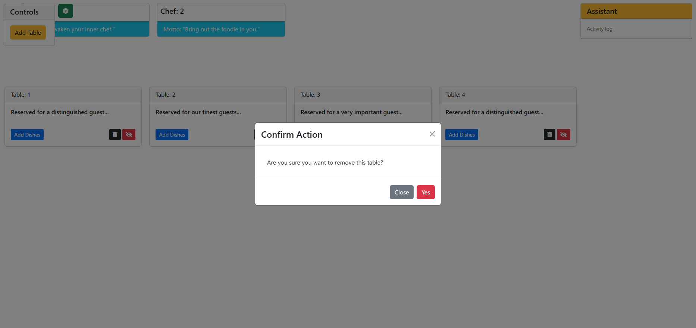

> 🌐 Language / Ngôn ngữ: [Tiếng Anh](How_it_work.md) | **Tiếng Việt**

Observer Pattern - Restaurant - Vue 2
=================

Ví dụ áp dụng Observer Pattern vào dự án nhà hàng đơn giản với Vue 2.

Phiên bản Vue 2 này hiển thị màn hình tải trước trong lúc bộ nạp thời chạy nạp mẫu giao diện gốc, dữ liệu món ăn, kho trạng thái Vuex, và các component Vue dạng một tệp trực tiếp trong trình duyệt. Ngay sau đó, giao diện đã hiển thị xong nhưng vẫn còn mở hộp thoại chào mừng, còn phía dưới đã có sẵn khu vực điều khiển, các đầu bếp, bảng Assistant, và các bàn.

Có 2 bếp trong bản demo này để xem quy trình phân công chế biến

Tài liệu này gộp phần mô tả chi tiết theo từng bước với phần thuyết minh ảnh chụp màn hình vốn chỉ được tóm tắt trong README.

Các trạng thái chính của giao diện
------------

Màn hình tải trước khi ứng dụng Vue khởi động xong:

Màn hình đầu tiên sau khi hiển thị xong, vẫn còn mở hộp thoại chào mừng:

Thêm bàn từ khu vực `Controls`:

Hộp thoại dùng để chọn món cho một bàn, với vài món đã được chọn sẵn trong ảnh chụp này:

Hộp thoại xác nhận trước khi xóa bàn:

Gợi ý nổi cho thao tác đăng ký nhận cập nhật, hủy đăng ký, và xóa bàn:

Luồng chính
------------

1. Chờ màn hình tải kết thúc để bộ nạp thời chạy nạp `assets/app.html`, `assets/data.json`, mô-đun store, và các thành phần Vue trực tiếp trong trình duyệt.
2. Nhấn nút `Add Dishes` ở bàn bất kì để mở hộp thoại và xem các món đang có sẵn để chọn.
3. Nhấn vào tên món để chọn, có thể chọn nhiều món.
4. Nhấn nút `Order` để tạo một đơn gọi món cho từng món đã chọn. Bàn đang chọn sẽ đưa các món đó vào luồng xử lý của nhà hàng, và hàng đợi của **Assistant** được cập nhật cho bàn đó.
5. Assistant đưa các đơn vừa nhận vào hàng đợi, chờ 3 giây, rồi phân phối các món đang chờ cho những đầu bếp còn rảnh.
6. Khi đầu bếp đang bận, thẻ đầu bếp hiển thị món hiện tại và thanh tiến trình. Khi món đã sẵn sàng, đầu bếp sẽ thông báo cho Assistant.
7. Assistant ghi lại cả lần nhận món lẫn lần hoàn tất trong activity log và báo lại với các bàn đã đăng ký về món vừa nấu xong.
8. Nếu bàn nào đã gọi đúng món vừa hoàn tất, bàn đó sẽ bắt đầu tiến trình ăn và sau đó xóa món khỏi danh sách.

Chú ý khi xem
------------

1. Phiên bản này hiển thị màn hình tải trước khi màn hình chính xuất hiện, rồi vẫn giữ hộp thoại chào mừng ở lần hiển thị đầu tiên.
2. Assistant sẽ phân phối món cho các đầu bếp sau 3 giây nhận món từ các bàn.
3. Bếp thông báo cho Assistant: mỗi bếp có một **Observer**, và **Assistant** đăng ký nhận tin tức từ bếp
    1. Bếp sẽ hiển thị viền màu hồng khi làm xong món
    2. Assistant sẽ hiển thị viền màu xanh và ghi nhật ký bên dưới khi nhận được thông báo
    3. Assistant sẽ báo lại ngay cho tất cả bàn
4. Assistant thông báo cho bàn: Assistant có **Observer**, và các bàn đăng ký nhận tin tức từ Assistant
    1. Các bàn sẽ hiển thị viền màu vàng và tooltip `Receive updates from the assistant` khi nhận được thông báo
    2. Bàn nào đặt đúng món khi nhận thì bàn đó sẽ có thanh tiến trình ăn.
5. Ảnh gợi ý nổi ở trên hiển thị rõ cả hai trạng thái của nút đăng ký nhận cập nhật, `Subscribe to assistant updates` và `Unsubscribe from assistant updates`, cùng với nút xóa bàn.

Chuỗi quy trình Observer
------------

Hai đầu bếp có thể cùng nấu song song trong khi một bàn khác đã bắt đầu ăn món vừa hoàn tất trước đó:

Khi Assistant phát thông báo về món vừa hoàn tất, các bàn đã đăng ký sẽ cùng được highlight và các bàn khớp món sẽ bắt đầu ăn ngay:

Một đầu bếp có thể vẫn đang nấu trong khi đầu bếp còn lại đã rảnh sau khi hoàn tất món, còn bàn đã đăng ký vẫn giữ tooltip nhận cập nhật:

Nhật ký hoạt động của Assistant tiếp tục ghi lại các lần nhận món và hoàn tất món, trong khi các món đã giao dần tích lũy trên các bàn:

Các bàn đã đăng ký tiếp tục phản ứng song song trong khi các đầu bếp tiếp tục xử lý hàng đợi:

Một trạng thái về sau vẫn cho thấy các bàn đã đăng ký tiếp tục phản ứng trong khi Assistant ghi thêm cả pickup lẫn completed event:

-------------------

\ ゜o゜)ノ
