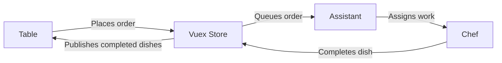
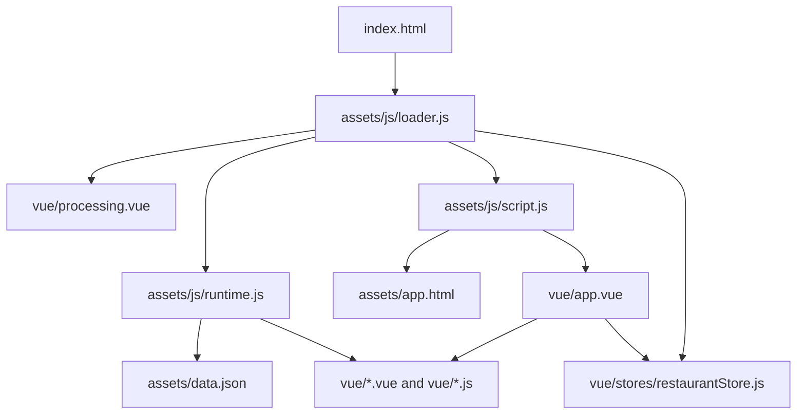

# Observer Pattern Restaurant with Vue 2
> 🌐 Language / Ngôn ngữ: **English** | [Tiếng Việt](README.vi.md)

This project is a browser-only Vue 2 demo that simulates a restaurant workflow using the Observer Pattern. Tables place orders, an assistant dispatches those orders to chefs, chefs process the dishes, and each table reacts when its food is ready.

The app does not use a build tool. Vue single-file components are loaded directly in the browser, which makes the project lightweight and easy to inspect.

## Technologies Used
- HTML5 and CSS3 for the page shell and custom styling.
- Vue 2 for the component-based browser UI.
- Vuex for centralized state management across tables, chefs, orders, and UI state.
- vue2-sfc-loader for loading `.vue` single-file components directly in the browser without a bundler.
- JavaScript (ES6+) for runtime bootstrapping, store logic, and application flow.
- Bootstrap 5 and BootstrapVue 2 for layout, modals, toasts, tooltips, and UI components.
- Font Awesome for interface icons.
- Draggabilly for draggable UI panels.
- Node.js and a small static server script for local serving.
- Playwright for smoke testing the main user workflow.

## What This Demo Shows
- A plain-browser Vue 2 application without Webpack, Vite, or a bundler.
- An Observer Pattern workflow applied to a restaurant scenario.
- Dynamic loading of `.vue` and `.js` files at runtime.
- A Vuex-based state layer that tracks tables, chefs, orders, and UI state.
- A Playwright smoke test for the main user flow.

## Main Flow
1. A table opens the menu and selects one or more items.
2. The assistant receives the orders and assigns them to available chefs.
3. Chefs process the dishes.
4. The assistant receives completion updates from chefs.
5. Subscribed tables react when their dishes are ready.

## Observer Flow Diagram


This is the main Observer Pattern loop in the demo: tables emit actions, the store and assistant coordinate work, chefs publish completion updates, and subscribed tables react to state changes.

## Architecture Diagram


The application boots from `index.html`, loads runtime helpers first, then pulls templates, store logic, data, and Vue components directly in the browser.

## Screenshots
### Application loading


### Application ready state


### Add items modal


### Add table action panel


### Remove table confirmation


### Tooltips and subscription controls


### Processing flow examples


## Runtime Architecture
- The application runs entirely in the browser.
- `assets/js/runtime.js` centralizes runtime loading, retry, timeout, cache, and error reporting.
- `assets/js/loader.js` initializes the app without using `eval`.
- `assets/js/script.js` loads the root HTML template and root Vue component.
- `vue/stores/restaurantStore.js` keeps the UI, tables, chefs, and orders in separate state domains while preserving the existing `restaurantStore/*` API used by components.

## Improvements Already Applied
- Replaced unsafe script loading via `eval` with script injection and controlled runtime loading.
- Added retry and timeout handling for runtime-loaded files.
- Added cache-backed loading for `assets/app.html`, `assets/data.json`, and Vue component fetches.
- Fixed completed dish delivery so results are stored per table instead of overwriting one global list.
- Exposed `Order.table_id` as a public read-only field for traceability.
- Standardized several UI labels and English text.
- Improved button semantics, live-region accessibility, and contrast for highlighted states.
- Added baseline `.editorconfig`, ESLint, and Prettier configuration.
- Added a Playwright smoke test for the main flow.

## Project Structure
```text
.
├── assets/
│   ├── app.html
│   ├── data.json
│   └── js/
│       ├── loader.js
│       ├── runtime.js
│       └── script.js
├── screenshots/
├── scripts/
│   └── serve-static.js
├── tests/
│   └── smoke.spec.js
├── vue/
│   ├── stores/
│   └── *.vue / *.js
├── index.html
├── package.json
└── playwright.config.js
```

## Run Locally
Because this project loads files with `fetch`, it should be served over HTTP instead of opened with `file://`.

### Option 1: Use any static server
Examples:
- `npx serve .`
- `python3 -m http.server 8080`

Then open the app in your browser.

### Option 2: Use the included test server
Install dependencies first:

```bash
npm install
```

Start the local static server:

```bash
npm run serve:test
```

The app will be available at `http://127.0.0.1:4173`.

## Smoke Test
Install dependencies:

```bash
npm install
```

Install the Playwright browser once:

```bash
npx playwright install chromium
```

Run the smoke test:

```bash
npm run test:smoke
```

The smoke test covers the primary workflow:
- Open the app
- Close the welcome modal
- Add an item to a table
- Verify the assistant receives the order
- Complete the chef processing step
- Complete the table consumption step

## Notes
- This project is intentionally browser-first and lightweight.
- Runtime component loading is useful for experimentation, but it is not a replacement for a production bundling pipeline.
- The included smoke test is meant to validate the main workflow quickly after changes.
