# Observer Pattern Restaurant với Vue 2
> 🌐 Language / Ngôn ngữ: [English](README.md) | **Tiếng Việt**

Đây là dự án demo Vue 2 chạy trực tiếp trên trình duyệt để mô phỏng quy trình vận hành của một nhà hàng bằng Observer Pattern. Bàn ăn tạo order, trợ lý tiếp nhận và phân phối order cho đầu bếp, đầu bếp xử lý món ăn, sau đó bàn ăn phản ứng khi món đã sẵn sàng.

Phiên bản Vue hiện cũng cố ý đồng bộ nhãn giao diện, slogan, câu chữ ở activity log và các mốc timeout với bản plain JavaScript để hai dự án dễ so sánh hơn.

Để đối chiếu nhanh giữa bản Vue 2 và bản plain JavaScript, hãy xem [PARITY_GUIDE.vi.md](./PARITY_GUIDE.vi.md) hoặc bản tiếng Anh [PARITY_GUIDE.md](./PARITY_GUIDE.md).

Dự án không dùng build tool. Các Vue single-file component được nạp động ngay trong trình duyệt, nên mã nguồn khá nhẹ và dễ quan sát.

## Công Nghệ Sử Dụng
- HTML5 và CSS3 cho khung trang và phần giao diện tùy biến.
- Vue 2 cho giao diện component chạy trực tiếp trên trình duyệt.
- Vuex để quản lý state tập trung cho bàn ăn, đầu bếp, order, và trạng thái UI.
- vue2-sfc-loader để nạp trực tiếp các file `.vue` single-file component trong trình duyệt mà không cần bundler.
- JavaScript (ES6+) cho phần khởi tạo runtime, logic store, và luồng xử lý của ứng dụng.
- Bootstrap 5 và BootstrapVue 2 cho layout, modal, toast, tooltip, và các thành phần giao diện.
- Font Awesome cho các biểu tượng trên giao diện.
- Draggabilly để kéo thả các panel trong giao diện.
- Node.js cùng script static server nhỏ để chạy dự án ở máy cục bộ.
- Playwright cho smoke test của luồng người dùng chính.

## Dự Án Minh Họa Điều Gì
- Ứng dụng Vue 2 chạy trực tiếp trên trình duyệt, không dùng Webpack, Vite, hay bundler.
- Một luồng Observer Pattern áp dụng vào bài toán nhà hàng.
- Nhãn giao diện, tooltip, slogan, và activity log được đồng bộ với bản plain JavaScript.
- Cách nạp động file `.vue` và `.js` trong runtime.
- Lớp quản lý trạng thái bằng Vuex để theo dõi bàn ăn, đầu bếp, order, và trạng thái giao diện.
- Smoke test bằng Playwright cho luồng người dùng chính.

## Luồng Chính
1. Bàn ăn mở thực đơn và chọn một hoặc nhiều món.
2. Trợ lý nhận order và phân phối cho đầu bếp phù hợp.
3. Đầu bếp xử lý món ăn.
4. Trợ lý nhận thông báo hoàn tất từ đầu bếp.
5. Các bàn đã đăng ký theo dõi sẽ phản ứng khi món ăn sẵn sàng.

## Sơ Đồ Observer Flow
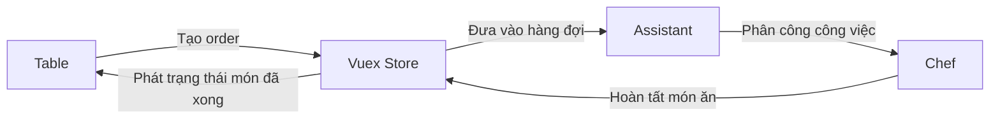

Đây là vòng lặp Observer Pattern chính của demo: bàn ăn phát sinh hành động, store và trợ lý điều phối công việc, đầu bếp phát trạng thái hoàn tất, và các bàn đã subscribe sẽ phản ứng theo thay đổi trạng thái.

## Sơ Đồ Kiến Trúc
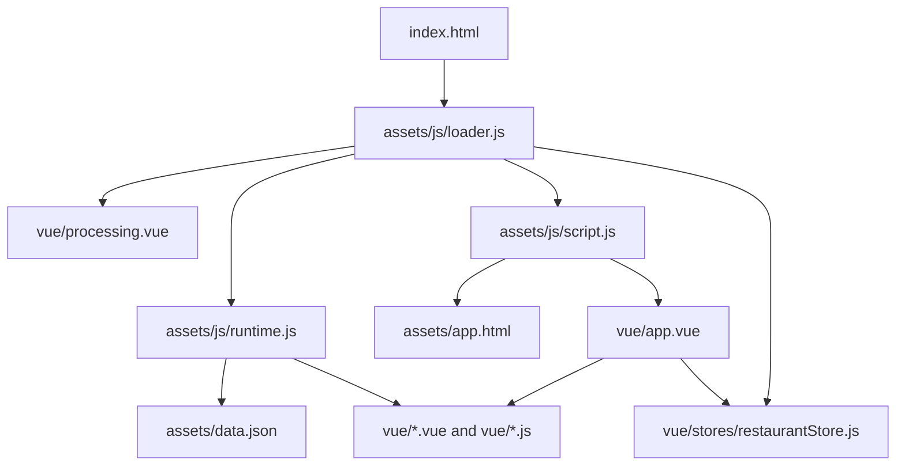

Ứng dụng khởi động từ `index.html`, nạp helper runtime trước, rồi tiếp tục lấy template, store, data, và các Vue component trực tiếp trong trình duyệt.

## Ảnh Chụp Màn Hình
### Màn hình đang tải ứng dụng
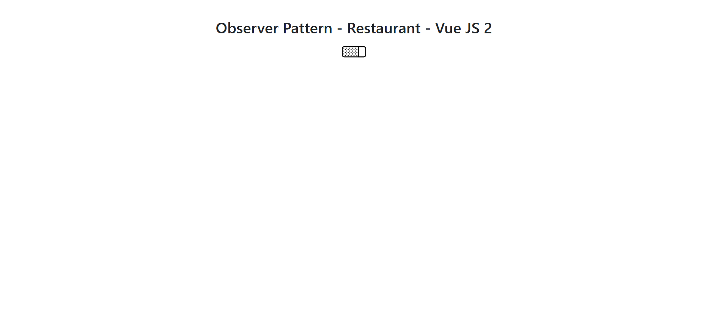

### Màn hình sau khi ứng dụng sẵn sàng
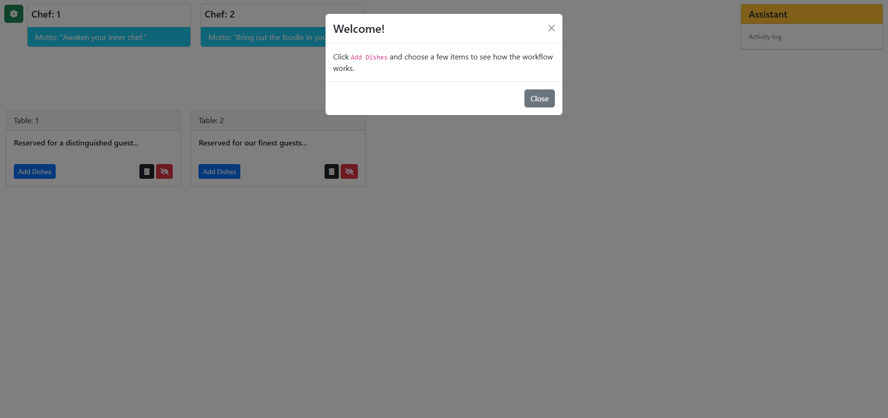

### Hộp thoại thêm món
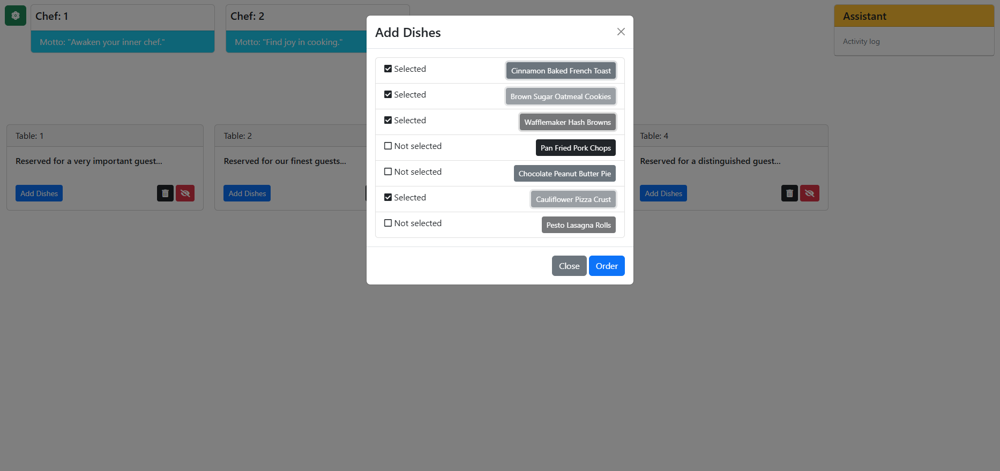

### Khu vực thao tác thêm bàn
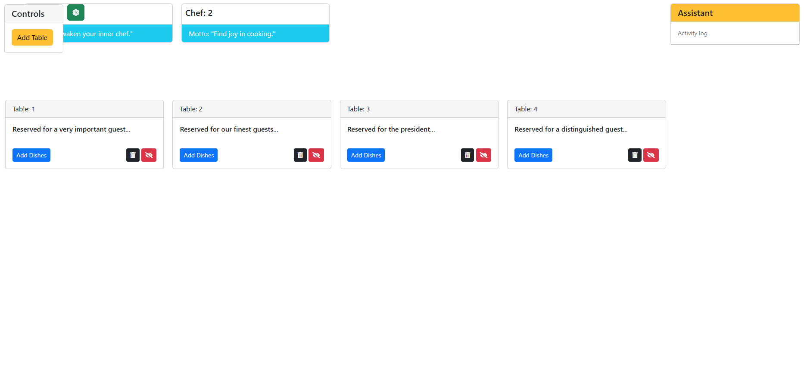

### Hộp thoại xác nhận xóa bàn


### Tooltip và điều khiển subscribe
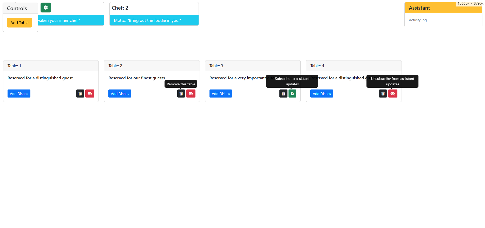

### Ví dụ luồng xử lý món ăn
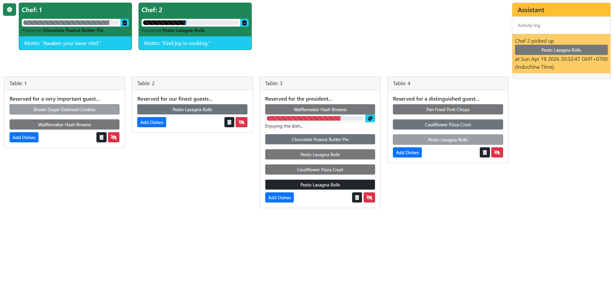
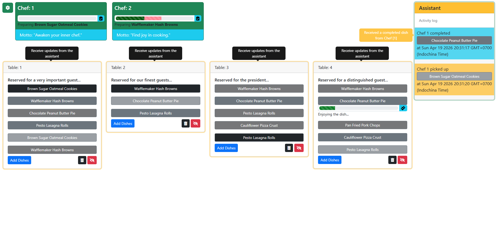
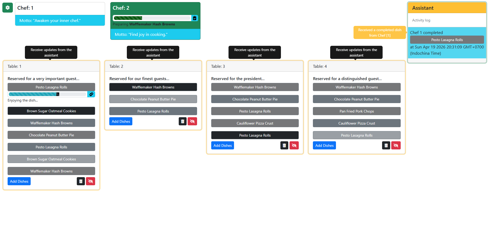
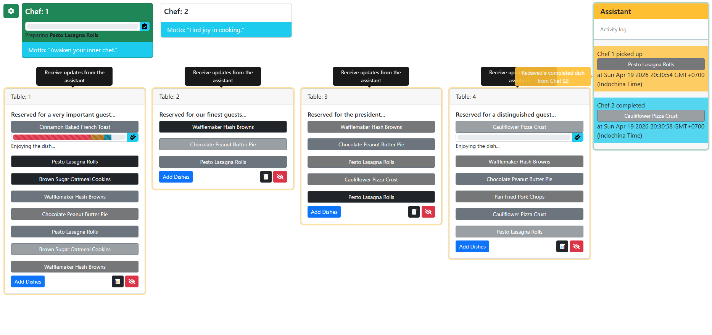
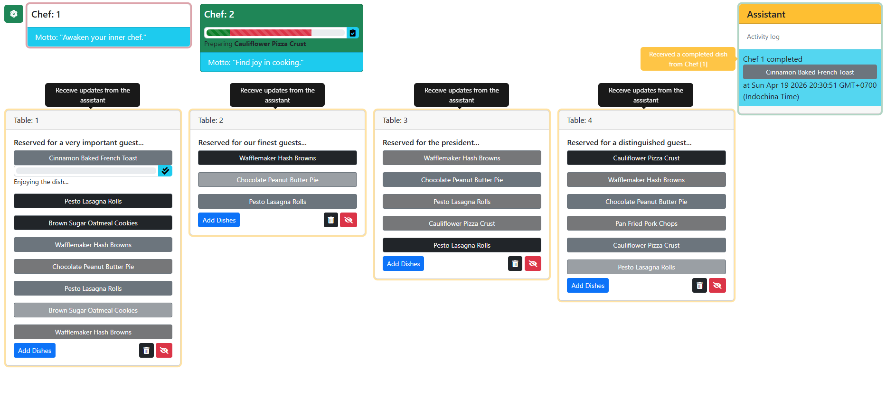
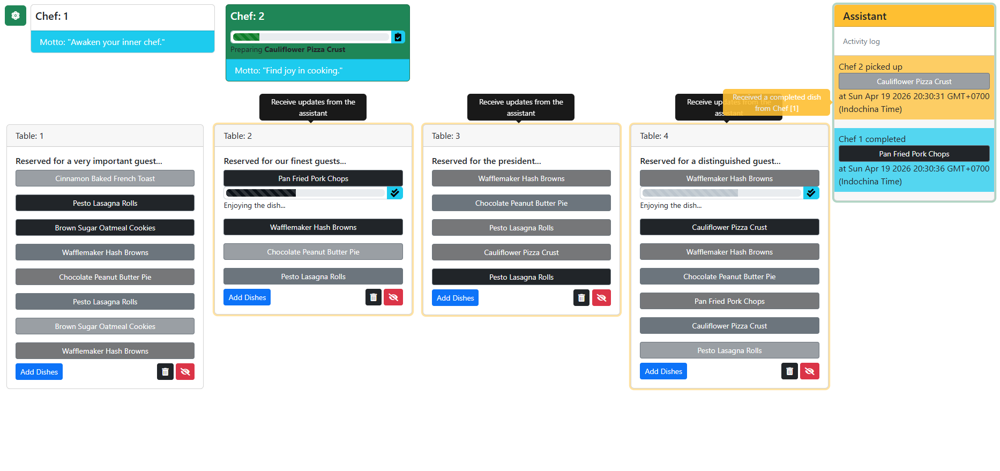

## Kiến Trúc Runtime
- Ứng dụng chạy hoàn toàn trong trình duyệt.
- `assets/js/runtime.js` tập trung logic nạp file runtime, retry, timeout, cache, và báo lỗi.
- `assets/js/loader.js` khởi tạo ứng dụng mà không dùng `eval`.
- `assets/js/script.js` nạp HTML template gốc và Vue component gốc.
- `vue/stores/restaurantStore.js` giữ riêng các miền trạng thái như UI, tables, chefs, và orders, đồng thời vẫn giữ API `restaurantStore/*` mà các component đang sử dụng.

## Các Cải Tiến Đã Áp Dụng
- Loại bỏ cách nạp script không an toàn bằng `eval`, thay bằng script injection và runtime loader có kiểm soát.
- Thêm cơ chế retry và timeout cho các file được nạp động trong runtime.
- Thêm cache cho `assets/app.html`, `assets/data.json`, và các request lấy Vue component.
- Sửa lỗi món hoàn tất bị ghi đè bằng cách lưu kết quả theo từng bàn thay vì dùng một danh sách toàn cục.
- Expose `Order.table_id` như một trường public chỉ đọc để dễ truy vết.
- Chuẩn hóa nhãn giao diện, slogan, tooltip, và activity log của bản Vue để khớp hơn với bản plain JavaScript.
- Cải thiện semantics của button, live-region cho accessibility, và độ tương phản của trạng thái highlight.
- Thêm cấu hình cơ bản cho `.editorconfig`, ESLint, và Prettier.
- Thêm smoke test Playwright cho luồng chính.

## Cấu Trúc Dự Án
```text
.
├── assets/
│   ├── app.html
│   ├── data.json
│   └── js/
│       ├── loader.js
│       ├── runtime.js
│       └── script.js
├── screenshots/
├── scripts/
│   └── serve-static.js
├── tests/
│   └── smoke.spec.js
├── vue/
│   ├── stores/
│   └── *.vue / *.js
├── index.html
├── package.json
└── playwright.config.js
```

## Chạy Ở Máy Cục Bộ
Vì dự án nạp file bằng `fetch`, bạn nên chạy nó qua HTTP thay vì mở trực tiếp bằng `file://`.

### Cách 1: Dùng bất kỳ static server nào
Ví dụ:
- `npx serve .`
- `python3 -m http.server 8080`

Sau đó mở ứng dụng trên trình duyệt.

### Cách 2: Dùng server test đi kèm
Cài dependency trước:

```bash
npm install
```

Khởi động static server cục bộ:

```bash
npm run serve:test
```

Ứng dụng sẽ chạy tại `http://127.0.0.1:4173`.

## Smoke Test
Cài dependency:

```bash
npm install
```

Cài trình duyệt Playwright một lần:

```bash
npx playwright install chromium
```

Chạy smoke test:

```bash
npm run test:smoke
```

Smoke test bao phủ luồng chính sau:
- Mở ứng dụng
- Đóng welcome modal
- Thêm món vào một bàn
- Xác nhận trợ lý đã nhận order
- Hoàn tất bước xử lý của đầu bếp
- Hoàn tất bước tiêu thụ món ở bàn

## Ghi Chú
- Dự án này cố ý giữ cách tiếp cận browser-first và gọn nhẹ.
- Runtime component loading phù hợp cho thử nghiệm và minh họa, nhưng không thay thế được quy trình bundling cho production.
- Smoke test đi kèm nhằm xác nhận nhanh luồng chính sau mỗi lần thay đổi.